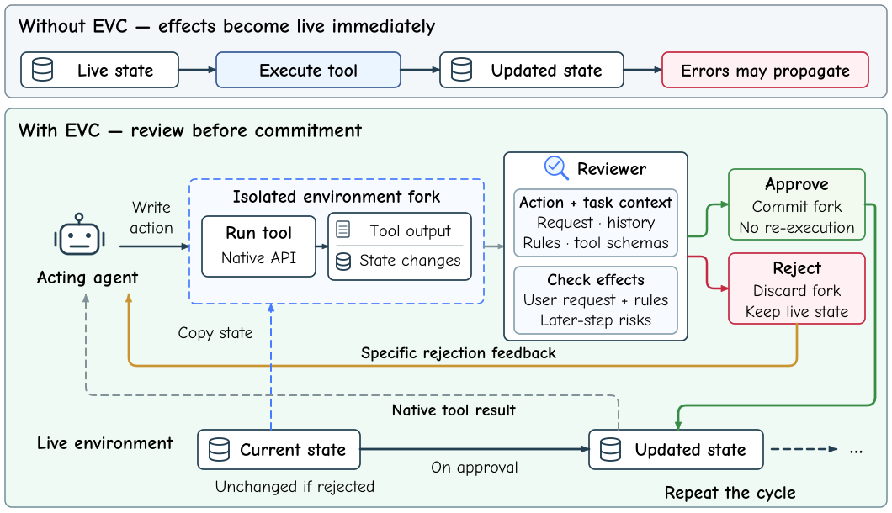

# Execute-Verify-Commit

Official repository for **Execute–Verify–Commit: Action-level Verification for Long-Horizon Agents**.

## Method

A tool call can execute successfully yet leave the environment in a state that
conflicts with the user's request or prevents later steps from succeeding.
**EVC separates execution from commitment:** an acting agent's proposed
state-changing action is executed once in an isolated environment fork. A
reviewer checks the actual tool output and state changes against the request,
conversation history, operating rules, and tool schemas.



Approval commits the exact reviewed state without re-executing the action and
returns the native tool result. Rejection discards the candidate changes and
returns specific feedback, so the agent can revise its next action from the
unchanged live state. EVC is training-free and preserves the acting agent's
planning loop; read-only calls, user-side actions, and ordinary conversation
continue through their native execution paths.

## Code and assets

| Entry | Path |
| --- | --- |
| Execute–review–commit loop and decision aggregation | [`runtime.py`](shadow-verifier/src/shadow_verifier/runtime.py) |
| Environment and reviewer interfaces | [`protocols.py`](shadow-verifier/src/shadow_verifier/protocols.py) |
| Review prompts and evidence projection | [`reviewers/`](shadow-verifier/src/shadow_verifier/reviewers/) |
| LLM and Jev reviewer backends | [`backends/`](shadow-verifier/src/shadow_verifier/backends/) |
| Benchmark integration | [`τ-bench`](workflow/tau_bench/), [`τ²`](workflow/tau2/), [`STATE`](workflow/state_bench/) |
| Paper configuration | [`configs/paper.json`](configs/paper.json) |
| Experiment entry point | [`experiments/run.py`](experiments/run.py) |
| Method figure | [`assets/evc-overview.svg`](assets/evc-overview.svg) |
| Local benchmark checkouts / generated runs | `external/` / `outputs/` |

## Quick start

Use Python 3.12 or 3.13. Install EVC and inspect the resolved configuration:

```bash
python -m pip install -e .
python -m experiments.run --benchmark tau_bench
python -m unittest discover -s tests -v
```

The default uses Qwen3.8-max as acting agent and reviewer, one binary review per
candidate action (B1), and seeds 42–45. Change `--producer`, `--reviewer`,
`--setting`, or `--seeds`; `--reviewer self` selects self-review. Role-specific
parameters and task budgets are defined in [`configs/paper.json`](configs/paper.json).

| Setting | Review rule |
| --- | --- |
| `baseline` | Native execution without review |
| `b1` | One binary review |
| `b3`, `b5`, `b7` | Strict majority of 3, 5, or 7 reviews |
| `prob_es` | Up to five probability reviews; stop on `p<0.3` or `p>0.7`, otherwise approve only if the mean exceeds 0.7 |
| `jev` | Jev approval probability and fixed rejection-category feedback |
| `hidden_effect` | B1 with the candidate's execution effects hidden from the reviewer |

Prepare a benchmark, set `DASHSCOPE_API_KEY` in the process environment, and run:

```bash
python -m experiments.prepare tau_bench
python -m pip install -e external/tau-bench
python -m experiments.run --benchmark tau_bench --domain retail --tasks 0 --setting b1 --execute
```

Use `tau2` or `state_bench` with their corresponding `external/tau2-bench` or
`external/state-bench` checkout. Choose task IDs from the installed benchmark's
official split. Jev additionally uses `TYPESAFE_API_KEY`. `--workers` controls
parallel trajectories, and `--output` selects the output directory. Without
`--execute`, the launcher prints the configuration without making model calls.
